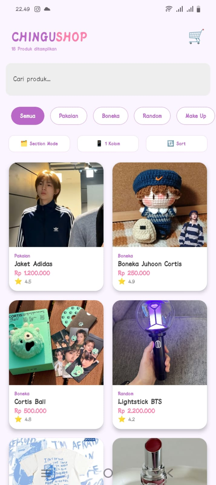
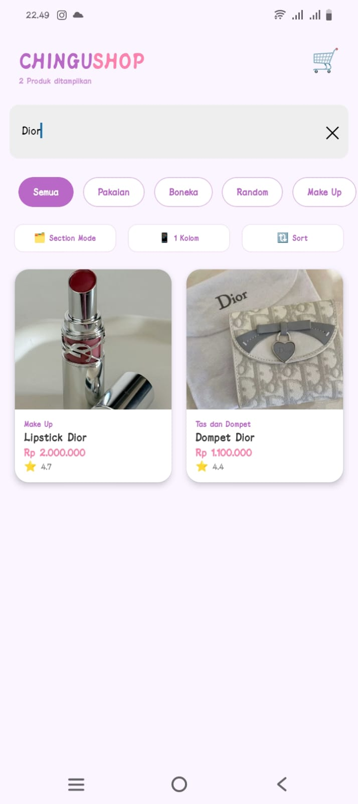
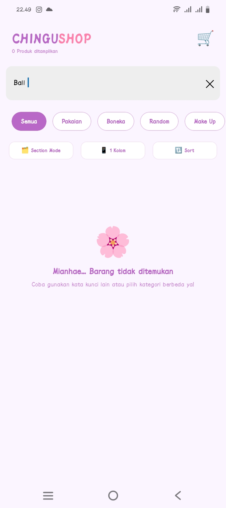
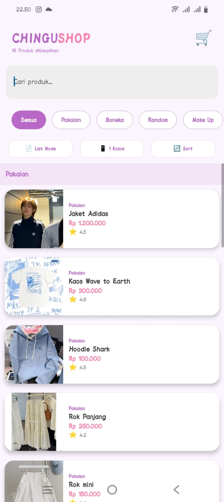
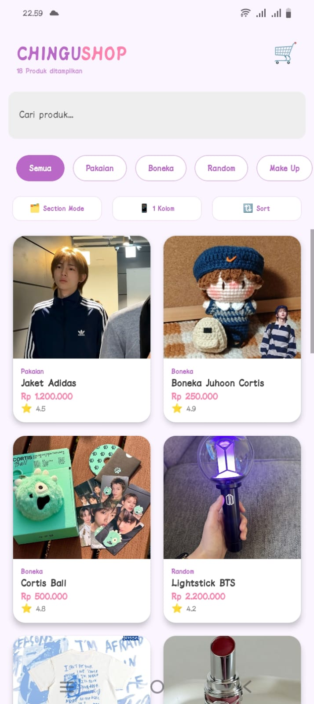
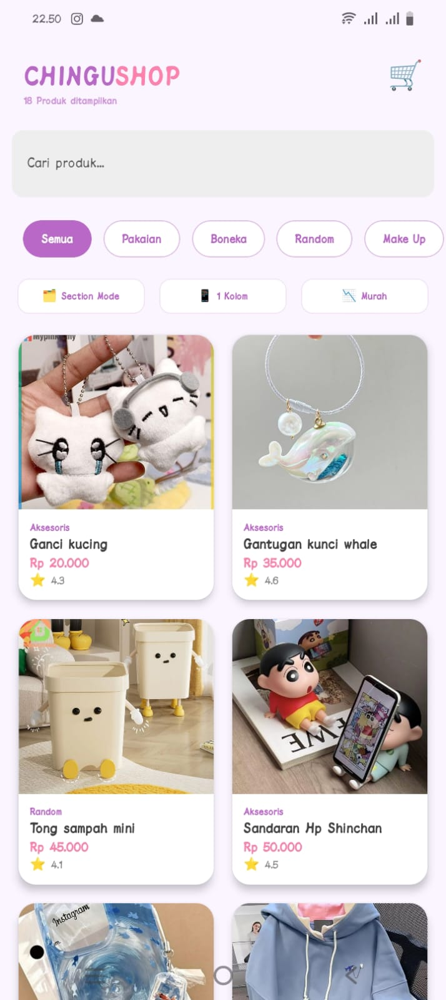
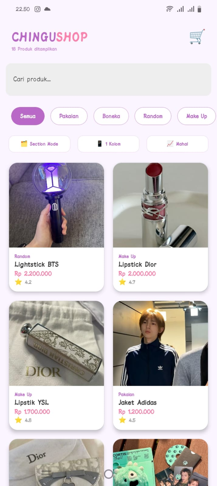
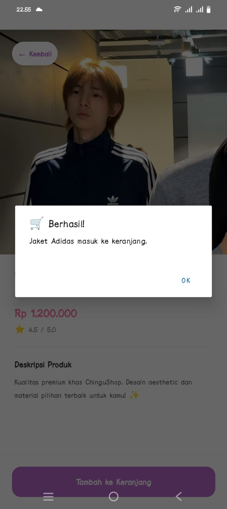
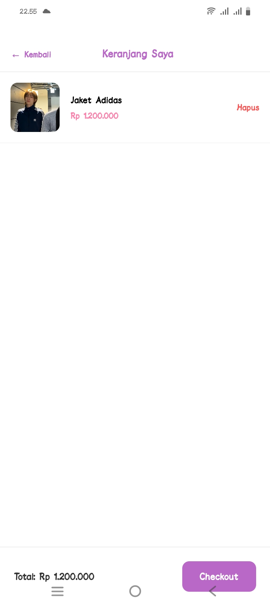

<<<<<<< HEAD
=======
## Nama & NIM
- Nama: Stephani della christin zai
- NIM:  243303621228

## Fitur yang Diimplementasikan
- [x] FlatList dengan 12+ produk
- [x] Custom ProductCard component (file terpisah)
- [x] keyExtractor dengan ID unik
- [x] ListEmptyComponent (empty state)
- [x] Search / Filter real-time
- [x] Pull-to-Refresh
- [x] Filter Kategori (E1) 
- [x] Toggle List/Grid View (E2) 
- [x] SectionList Mode (E3) 
- [x] Sort Produk (E4) 

## Screenshot

### Tampilan Utama (List Produk)

### Tampilan Search — saat ada hasil

### Tampilan Empty State — saat tidak ada hasil

### Tampilan list mode

### Tampilan section mode

### Tampilan grid

### Tampilan list

### Tampilan rating

### Tampilan murah

### Tampilan mahal

### Tampilan deskripsi

### Tampilan berhasil masuk

### Tampilan keranjang

## Cara Menjalankan
1. Clone repo  : git clone [https://github.com/stephani689/pemmobile-p06-Stephani]
2. Install deps: npm install
3. Jalankan    : npx expo start
4. Scan QR Code dengan Expo Go di HP

>>>>>>> ff5abef (Update fitur + tambah gambar + README)
